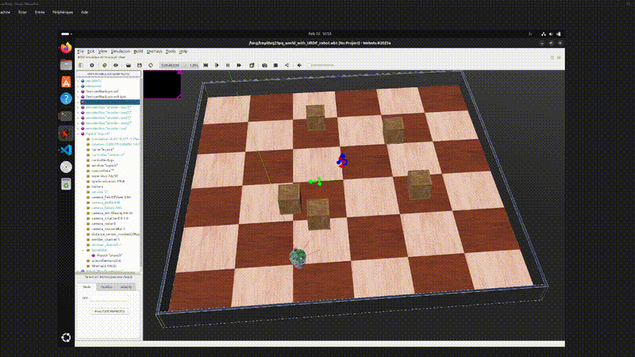

# E-Puck



## E-Puck ROS 2 Controller

Ce dépôt contient le package ROS 2 pour le robot e-puck. 
**Attention :** Pour compiler ce projet, il doit impérativement être placé dans un dossier `src/` au sein d'un workspace ROS 2.

### Structure attendue
Pour que `colcon build` fonctionne, votre dossier doit ressembler à ceci :
```text
ros2_ws/
└── src/
    └── E-Puck/ (Ce dépôt)
        ├── CMakeLists.txt
        ├── package.xml
        └── src/
            └── intelligent_robot.cpp
```

## Installation Rapide
### Créer le workspace et cloner le projet :

```bash
mkdir -p ~/ros2_ws/src
cd ~/ros2_ws/src
git clone [https://github.com/TON_PSEUDO/ros2_ws.git](https://github.com/TON_PSEUDO/ros2_ws.git) E-Puck
```
### Compiler le projet :

```bash
cd ~/ros2_ws
colcon build --packages-select mon_robot_cpp
source install/setup.bash
```

### Lancement
Lancer Webots (Terminal 1) :

```bash
source /opt/ros/jazzy/setup.bash
ros2 launch webots_ros2_epuck robot_launch.py
```

Lancer le contrôleur (Terminal 2) :

```bash
cd ~/ros2_ws
source install/setup.bash
ros2 run mon_robot_cpp mon_cerveau_cpp --ros-args -p use_sim_time:=true
```

### Debugging
Si le robot ne bouge pas, vérifiez la correspondance des messages :

Topic : /cmd_vel

Type : geometry_msgs/msg/TwistStamped
